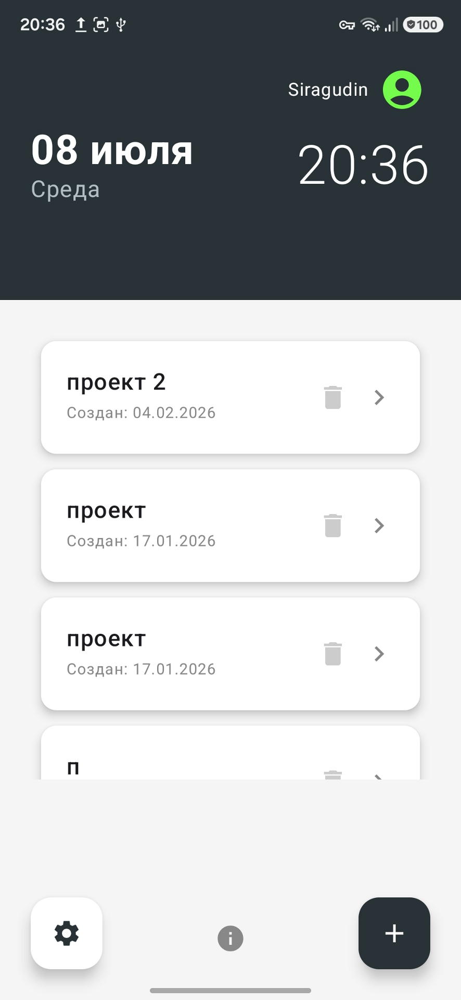
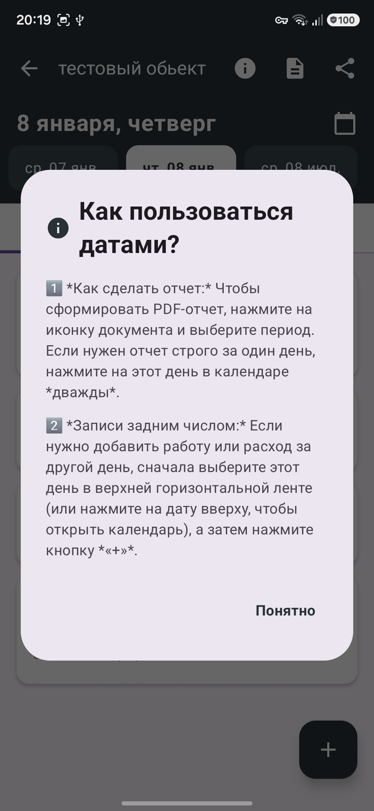
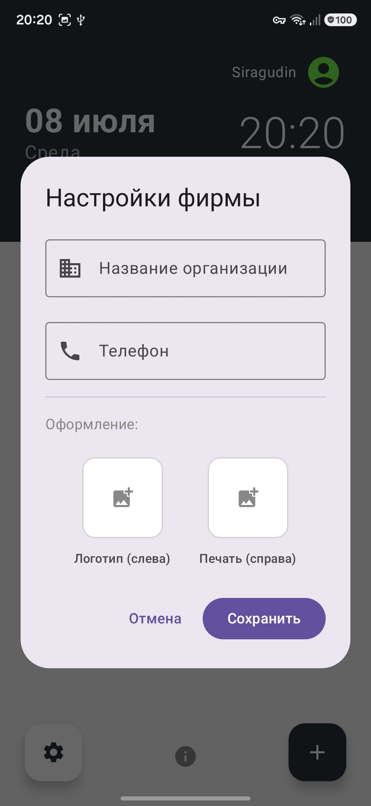
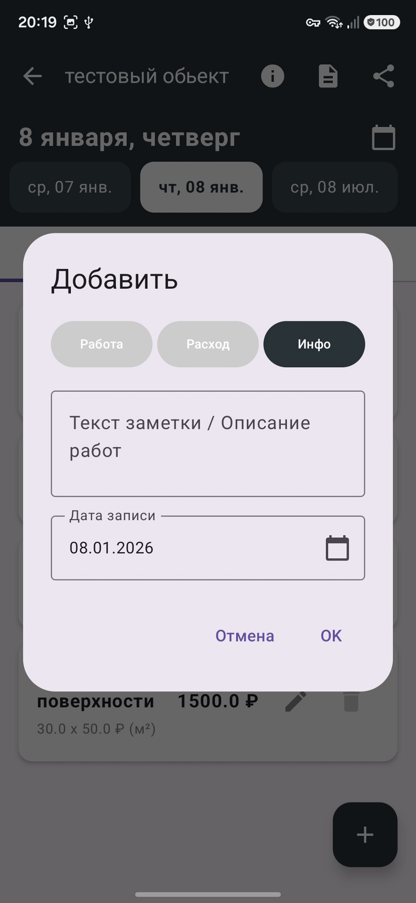
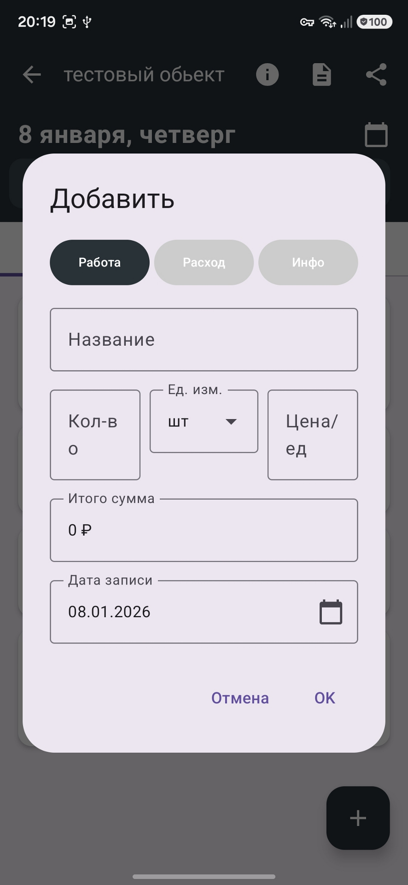
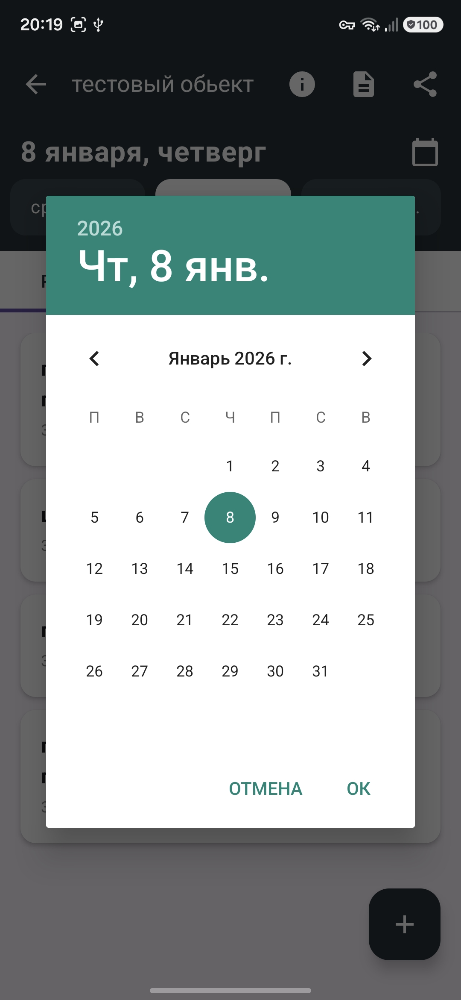

# Прораб

> **Простой и надёжный инструмент для ведения строительных объектов прямо со смартфона.**

  
  
  
  
  
  

## О приложении

Забудьте о бумажных блокнотах и сложных таблицах Excel.

**«Прораб»** создан специально для мастеров, прорабов и подрядчиков, которым нужно держать строительные объекты, работы, расходы и документы под контролем.

Вся необходимая информация — в одном приложении.

## Возможности

### 🏗️ Все объекты в одном месте

Создавайте отдельные проекты и ведите учёт работ и материалов по каждому объекту. Информация по разным стройкам не смешивается.

### 📄 Профессиональные PDF-отчёты

Формируйте документы прямо из приложения.

PDF-документы могут содержать:

* информацию об объекте;
* выполненные работы;
* материалы;
* стоимость;
* логотип;
* печать.

Готовый документ можно отправить заказчику удобным способом.

### 💰 Контроль финансов

Фиксируйте стоимость работ и расходы на материалы.

Так проще понимать реальные затраты и прибыль по каждому объекту.

### ☁️ Синхронизация и сохранность данных

Данные синхронизируются с облаком, поэтому продолжить работу можно даже после смены устройства.

Вход выполняется через Google-аккаунт.

### 🎨 Удобный интерфейс

* минималистичный интерфейс;
* быстрая работа;
* тёмная тема;
* минимум настроек;
* без назойливой рекламы.

## Технологии

Проект разработан для Android с использованием современных инструментов Android-разработки.

Основной стек:

* **Kotlin**
* **Android**
* **Jetpack Compose**
* **Gradle**
* **Room**
* **Firebase**
* **Google Sign-In**
* **PDF generation**

## Установка

Стабильные версии приложения доступны в разделе **Releases** этого репозитория.

Для установки APK скачайте соответствующий файл релиза и установите его на Android-устройство.

> Для сборки проекта из исходного кода потребуется Android Studio и установленный Android SDK.

## Версия

**Prorab 2.0.0 — Stable Release**

Это первый стабильный публичный релиз версии 2.0.

## Исходный код

Репозиторий содержит исходный код приложения и необходимые файлы для его сборки.

Конфиденциальные и локальные файлы проекта, включая `local.properties`, `.idea` и конфигурацию Firebase, не включены в публичный репозиторий.

## Автор

**Siragudin/Сиражудин Гусейнов**

---

